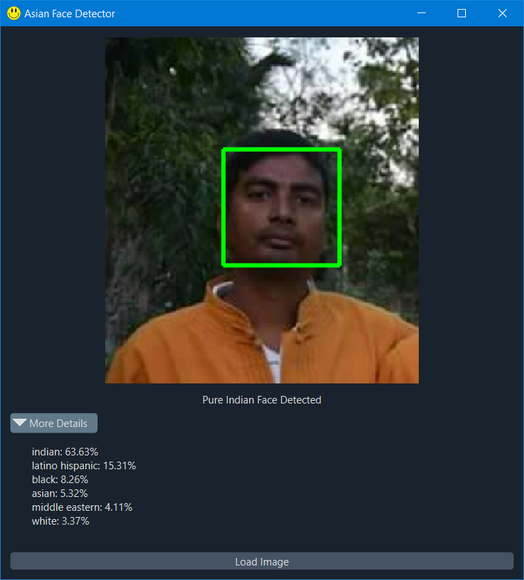

<h1 align='center'>  Asian Face Detector</h1>
<p align='center'>
    <br>
    A Simple Python-based App to check if you have Asian features or not
</p>

## Synopsis

Enter an image to scan and the AI can tell how much Asian features (or other racial features you have). Perfect to call out some non-ahoms calling themselves Ahom without having even 1% Asian DNA<br><br>
<br>

## Installation

Install the [requirements](#requirements)
```bash
pip install PySide6
pip install cv2
pip install qdarkstyle
pip install deepface
```


## Requirements
- PySide6
- cv2
- qdarkstyle
- deepface

